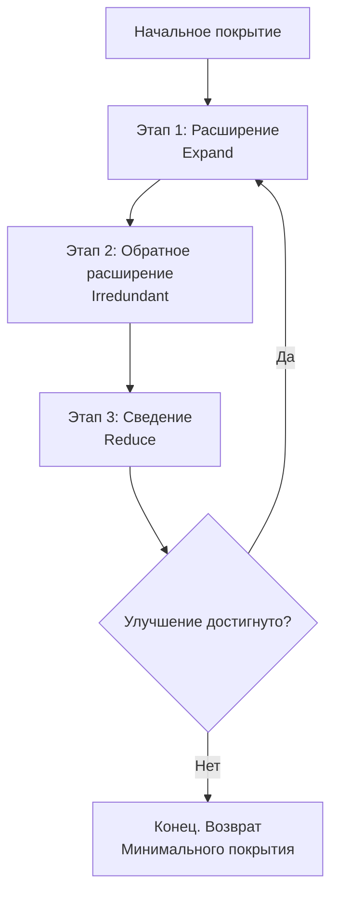

#Преобразование произвольной логической формулы в конъюнктивную (КНФ) и дизъюнктивную (ДНФ) нормальную форму. Пошаговая инструкция


## Общая концепция

И **КНФ**, и **ДНФ** являются нормированными представлениями логических формул. Они строятся из:
*   **Литералов**: переменных (например, `A`) или их отрицаний (¬`A`).
*   **Элементарных дизъюнкций** (дизъюнктов): выражений вида `A ∨ B ∨ ¬C`. Конъюнкция таких дизъюнктов — это **КНФ**.
    *   Пример КНФ: `(A ∨ ¬B) ∧ (B ∨ C)`
*   **Элементарных конъюнкций** (конъюнктов): выражений вида `A ∧ B ∧ ¬C`. Дизъюнкция таких конъюнкций — это **ДНФ**.
    *   Пример ДНФ: `(A ∧ B) ∨ (B ∧ ¬C)`

Цель преобразования — избавиться от всех логических операций, кроме `∧`, `∨` и `¬`, и привести формулу к нужной структуре.

---

## Универсальный алгоритм преобразования (шаги 1-4 общие)

Независимо от того, какую форму вы хотите получить (КНФ или ДНФ), первые четыре шага одинаковы.

**Шаг 1: Устранить импликацию и эквивалентность**
Замените все вхождения операций `→` и `↔` на их эквивалентные выражения, использующие только `∧`, `∨`, `¬`.
*   `A → B` эквивалентно `¬A ∨ B`
*   `A ↔ B` эквивалентно `(A ∧ B) ∨ (¬A ∧ ¬B)` или `(¬A ∨ B) ∧ (A ∨ ¬B)`

**Шаг 2: Продвинуть отрицания (Привести к нормальной форме отрицания)**
Используйте **законы де Моргана**, чтобы "продвинуть" отрицания (`¬`) к самим переменным. Это значит, что знак отрицания должен стоять только перед переменной, а не перед целой скобкой.
*   ¬(A ∧ B) эквивалентно ¬A ∨ ¬B
*   ¬(A ∨ B) эквивалентно ¬A ∧ ¬B
*   Также используйте закон двойного отрицания: ¬¬A эквивалентно A

**Пример:** Преобразуем ¬(A ∨ ¬B)
1.  Применяем де Моргана: ¬A ∧ ¬(¬B)
2.  Применяем двойное отрицание: ¬A ∧ B
Теперь все отрицания стоят только перед переменными.

**Шаг 3: Применить законы дистрибутивности (здесь пути к ДНФ и КНФ расходятся)**
Это ключевой шаг, который определяет, получится у вас КНФ или ДНФ.

---

## Алгоритм для получения Дизъюнктивной Нормальной Формы (ДНФ)

**Цель:** Представить формулу в виде дизъюнкции конъюнктов.

На **Шаге 3** для ДНФ нужно применять **дистрибутивность конъюнкции относительно дизъюнкции**:
`A ∧ (B ∨ C)` эквивалентно `(A ∧ B) ∨ (A ∧ C)`

**Общая тактика:** Раскрывать скобки, чтобы конъюнкция оказалась "внутри", а дизъюнкция — "снаружи".

**Шаг 4 (для ДНФ): Упрощение (опционально, но рекомендуется)**
*   Удалить повторяющиеся литералы в конъюнктах: `(A ∧ A ∧ B)` -> `(A ∧ B)`
*   Удалить конъюнкты, которые заведомо ложны (содержат `A` и `¬A`).
*   Использовать законы поглощения.

---

## Алгоритм для получения Конъюнктивной Нормальной Формы (КНФ)

**Цель:** Представить формулу в виде конъюнкции дизъюнктов.

На **Шаге 3** для КНФ нужно применять **дистрибутивность дизъюнкции относительно конъюнкции**:
`A ∨ (B ∧ C)` эквивалентно `(A ∨ B) ∧ (A ∨ C)`

**Общая тактика:** Раскрывать скобки, чтобы дизъюнкция оказалась "внутри", а конъюнкция — "снаружи".

**Шаг 4 (для КНФ): Упрощение (опционально, но рекомендуется)**
*   Удалить повторяющиеся литералы в дизъюнктах: `(A ∨ A ∨ B)` -> `(A ∨ B)`
*   Удалить дизъюнкты, которые заведомо истинны (содержат `A` и `¬A`).
*   Использовать законы поглощения.

---

## Пример преобразования

Возьмем формулу: `(A → B) ∧ (B → C)`

**Шаг 1: Устраняем импликации**
`(¬A ∨ B) ∧ (¬B ∨ C)`

**Получаем КНФ:**
Форма `(¬A ∨ B) ∧ (¬B ∨ C)` уже является **КНФ**! Это конъюнкция двух дизъюнктов. Дальнейшие действия не требуются.

**Получаем ДНФ:**
Нам нужно превратить эту конъюнкцию в дизъюнкцию.

**Шаг 3 (для ДНФ):** Применяем дистрибутивность `∧` относительно `∨`. Наша формула имеет вид `X ∧ Y`, где `X = (¬A ∨ B)`, а `Y = (¬B ∨ C)`.

`(¬A ∨ B) ∧ (¬B ∨ C)` раскрывается как:
`[¬A ∧ (¬B ∨ C)] ∨ [B ∧ (¬B ∨ C)]` (дистрибутивность)

Теперь раскроем скобки внутри каждой части:
1.  `¬A ∧ (¬B ∨ C)` = `(¬A ∧ ¬B) ∨ (¬A ∧ C)` (дистрибутивность)
2.  `B ∧ (¬B ∨ C)` = `(B ∧ ¬B) ∨ (B ∧ C)` (дистрибутивность)

Подставляем обратно:
`[(¬A ∧ ¬B) ∨ (¬A ∧ C)] ∨ [(B ∧ ¬B) ∨ (B ∧ C)]`

**Шаг 4 (для ДНФ): Упрощаем**
*   `(B ∧ ¬B)` — это всегда ложь. Его можно удалить, так как в дизъюнкции `Ложь ∨ X` эквивалентно `X`.
*   Убираем лишние скобки (ассоциативность ∨).

**Итоговая ДНФ:**
`(¬A ∧ ¬B) ∨ (¬A ∧ C) ∨ (B ∧ C)`

Это дизъюнкция трех конъюнктов.

---

## Важное дополнение: Совершенная форма (СДНФ и СКНФ)

Часто требуются не просто КНФ/ДНФ, а **совершенные** нормальные формы (**СДНФ** и **СКНФ**). Их отличие в том, что в каждой элементарной конъюнкции (для СДНФ) или дизъюнкции (для СКНФ) должны присутствовать **все переменные** из используемого набора.

**Как получить совершенную форму?**
1.  Постройте таблицу истинности для формулы.
2.  **Для СДНФ:**
    *   Выберите все строки, где формула принимает значение **Истина (1)**.
    *   Для каждой такой строки составьте конъюнкцию всех переменных: если значение переменной в строке равно 1, берите ее саму, если 0 — берите ее отрицание.
    *   Объедините все полученные конъюнкции знаком дизъюнкции (`∨`).
3.  **Для СКНФ:**
    *   Выберите все строки, где формула принимает значение **Ложь (0)**.
    *   Для каждой такой строки составьте дизъюнкцию всех переменных: если значение переменной в строке равно 0, берите ее саму, если 1 — берите ее отрицание.
    *   Объедините все полученные дизъюнкции знаком конъюнкции (`∧`).

Этот метод надежен и прост для понимания, хотя и может быть громоздким для формул с большим количеством переменных.

## Итог

| Действие | Для ДНФ | Для КНФ |
| :--- | :--- | :--- |
| **1. Устранить →, ↔** | `A → B` становится `¬A ∨ B` | `A → B` становится `¬A ∨ B` |
| **2. Продвинуть ¬** | Использовать де Моргана: ¬(A ∧ B) -> ¬A ∨ ¬B | Использовать де Моргана: ¬(A ∨ B) -> ¬A ∧ ¬B |
| **3. Дистрибутивность** | **∧ над ∨**: `A ∧ (B ∨ C)` -> `(A ∧ B) ∨ (A ∧ C)` | **∨ над ∧**: `A ∨ (B ∧ C)` -> `(A ∨ B) ∧ (A ∨ C)` |
| **4. Упрощение** | Удалить противоречивые конъюнкты | Удалить тождественно истинные дизъюнкты |


## Закон поглощения

### Суть закона поглощения

Закон поглощения гласит, что если у нас есть логическое выражение, состоящее из операции И (конъюнкции, `∧`) или ИЛИ (дизъюнкции, `∨`) над переменными, где одна часть выражения является подмножеством другой, то всё выражение может быть "поглощено" (упрощено до) этой большей части.

Закон имеет две основные формы:

#### 1. Закон поглощения для конъюнкции (И)

**Формула:**
`A ∧ (A ∨ B) ≡ A`

**Словесная формулировка:**
Логическое И между выражением `A` и результатом логического ИЛИ между `A` и любым другим выражением `B` эквивалентно просто `A`. Выражение `(A ∨ B)` "поглощается" выражением `A`.

**Пример:**
"Сегодня идет дождь И (Сегодня идет дождь ИЛИ завтра будет солнце)"
Упрощается до: "Сегодня идет дождь".

Если сегодня идет дождь (`A` истинно), то вся скобка `(A ∨ B)` автоматически истинна (по определению ИЛИ). Таким образом, итоговое выражение `A ∧ (истина)` зависит только от `A`.
Если же сегодня дождя нет (`A` ложно), то и всё выражение ложно, независимо от `B`.

#### 2. Закон поглощения для дизъюнкции (ИЛИ)

**Формула:**
`A ∨ (A ∧ B) ≡ A`

**Словесная формулировка:**
Логическое ИЛИ между выражением `A` и результатом логического И между `A` и любым другим выражением `B` эквивалентно просто `A`. Выражение `(A ∧ B)` "поглощается" выражением `A`.

**Пример:**
"Я куплю яблоки ИЛИ (Я куплю яблоки И апельсины)"
Упрощается до: "Я куплю яблоки".

Если я покупаю яблоки (`A` истинно), то всё исходное выражение истинно (по определению ИЛИ).
Если я не покупаю яблоки (`A` ложно), то и выражение `(A ∧ B)` ложно (так как `ложь ∧ B = ложь`). Таким образом, итогом будет `ложь ИЛИ ложь = ложь`, что again зависит только от `A`.

### Наглядная проверка с помощью таблиц истинности

Мы можем доказать эквивалентность, построив таблицы истинности для обеих частей уравнений.

**Проверка закона `A ∧ (A ∨ B) ≡ A`:**

| A | B | A ∨ B | A ∧ (A ∨ B) |
|---|---|-------|-------------|
| 0 | 0 |   0   |      0      |
| 0 | 1 |   1   |      0      |
| 1 | 0 |   1   |      1      |
| 1 | 1 |   1   |      1      |

Сравниваем последний столбец (`A ∧ (A ∨ B)`) и первый столбец (`A`). Они **идентичны**. Что и требовалось доказать.

**Проверка закона `A ∨ (A ∧ B) ≡ A`:**

| A | B | A ∧ B | A ∨ (A ∧ B) |
|---|---|-------|-------------|
| 0 | 0 |   0   |      0      |
| 0 | 1 |   0   |      0      |
| 1 | 0 |   0   |      1      |
| 1 | 1 |   1   |      1      |

Последний столбец (`A ∨ (A ∧ B)`) снова **идентичен** первому столбцу (`A`).

### Аналогия с теорией множеств

Закон поглощения также работает в теории множеств, что помогает лучше понять его суть.

*   **Для объединения (аналог ИЛИ):** `A ∪ (A ∩ B) = A`
    Объединение множества `A` с его частью (пересечением с `B`) даст просто множество `A`.
    

*   **Для пересечения (аналог И):** `A ∩ (A ∪ B) = A`
    Пересечение множества `A` с бóльшим множеством (которое включает `A` и `B`) даст просто множество `A`.
    

### Зачем это нужно?

Главное применение закона поглощения — **упрощение логических выражений**. Сложные формулы, используемые в алгоритмах, цифровой схемотехнике, проектировании баз данных и написании условий в программировании, часто можно сделать намного короче и понятнее, применяя этот и другие законы логики (де Моргана, дистрибутивный и т.д.). Это повышает эффективность и снижает вероятность ошибок.

**Итог:** Закон поглощения — это мощный инструмент для преобразования и упрощения логических выражений, который показывает, что добавление избыточной информации (через `∧` или `∨`) не меняет исходного значения выражения.


> У меня есть логическое выражение.
> Использованы для упрощения все законы логики - де Моргана, схлопывание двойного отрицания, "спуск" отрицаний, законы поглощения и тп.
> Но сложное выражение всё равно выглядит, как многоуровневое дерево.
> Я же хочу, чтобы выражение было деревом константной глубины - то есть, либо в форме ДНФ, либо в форме КНФ.
> Что мне надо сделать для этого?

Отличный вопрос! Вы столкнулись с классической ситуацией. Упрощение выражений с помощью законов де Моргана, поглощения и т.д. — это *эквивалентное преобразование*. Оно сохраняет структуру дерева и делает его "изящнее", но не меняет его фундаментальную многоуровневую природу.

Чтобы получить форму постоянной глубины (ДНФ или КНФ), нужен не просто процесс *упрощения*, а процесс *нормализации* (приведения к нормальной форме). Это алгоритмическая процедура.

Вот что вам нужно сделать, шаг за шагом:

### 1. Определитесь с целевой формой

*   **ДНФ (Дизъюнктивная нормальная форма)**:
    Это ИЛИ одного или нескольких И.
    Структура: `(И) ИЛИ (И) ИЛИ (И) ...`
    Пример: `(A ∧ ¬B ∧ C) ∨ (¬A ∧ D) ∨ (B)`

*   **КНФ (Конъюнктивная нормальная форма)**:
    Это И одного или нескольких ИЛИ.
    Структура: `(ИЛИ) И (ИЛИ) И (ИЛИ) ...`
    Пример: `(A ∨ ¬B ∨ C) ∧ (¬A ∨ D) ∧ (B ∨ C)`

Выбор между ДНФ и КНФ часто зависит от дальнейшего применения. Например, КНФ невероятно важна для задачи выполнимости (SAT).

---

### 2. Выберите метод приведения

Есть два основных алгоритмических пути.

#### Метод 1: Через таблицу истинности (Наиболее straightforward для небольшого числа переменных)

Этот метод гарантированно даст вам **совершенную ДНФ (СДНФ)** или **совершенную КНФ (СКНФ)**.

**Для получения СДНФ:**
1.  Постройте таблицу истинности для вашего выражения.
2.  Выберите **все строки, где выражение равно `1` (истина)**.
3.  Для каждой такой строки составьте конъюнкцию (И) всех переменных.
    *   Если переменная в этой строке равна `1`, берите её саму.
    *   Если переменная равна `0`, берите её отрицание.
4.  Соедините все полученные конъюнкции знаком дизъюнкции (ИЛИ).

**Пример:** Для выражения, которое истинно при `(A=0, B=1)` и `(A=1, B=0)`.
*   Для первого набора: `¬A ∧ B`
*   Для второго набора: `A ∧ ¬B`
*   **СДНФ:** `(¬A ∧ B) ∨ (A ∧ ¬B)` (Это известное "исключающее ИЛИ").

**Для получения СКНФ:**
1.  Постройте таблицу истинности.
2.  Выберите **все строки, где выражение равно `0` (ложь)**.
3.  Для каждой такой строки составьте дизъюнкцию (ИЛИ) всех переменных.
    *   Если переменная в этой строке равна `0`, берите её саму.
    *   Если переменная равна `1`, берите её отрицание.
4.  Соедините все полученные дизъюнкции знаком конъюнкции (И).

**Преимущества метода:**
*   Прост для понимания.
*   Всегда работает.

**Недостатки:**
*   Экспоненциальная сложность. Для `n` переменных нужно `2^n` строк. Уже при 6-8 переменных становится очень трудоёмко.

#### Метод 2: Алгебраическое преобразование (с помощью эквивалентностей)

Это более продвинутый способ, который не требует построения полной таблицы истинности.

**Алгоритм приведения к ДНФ:**
1.  **Избавьтесь от импликаций и эквивалентностей:**
    *   `A → B` заменяйте на `¬A ∨ B`
    *   `A ↔ B` заменяйте на `(A ∧ B) ∨ (¬A ∧ ¬B)`
2.  **"Загоните" отрицания к переменным** с помощью законов де Моргана и снятия двойного отрицания. У вас должны остаться отрицания только у переменных, а не у сложных выражений.
    *   `¬(A ∨ B)` становится `¬A ∧ ¬B`
    *   `¬(A ∧ B)` становится `¬A ∨ ¬B`
    *   `¬¬A` становится `A`
3.  **Воспользуйтесь дистрибутивностью** закона `∧` относительно `∨`, чтобы "перемножить" скобки, как в алгебре.
    *   `A ∧ (B ∨ C)` становится `(A ∧ B) ∨ (A ∧ C)`
    *   `(A ∨ B) ∧ (C ∨ D)` становится `(A ∧ C) ∨ (A ∧ D) ∨ (B ∧ C) ∨ (B ∧ D)`

**Алгоритм приведения к КНФ:**
Первые два шага *абсолютно такие же*.
1.  Убрать импликации и эквивалентности.
2.  Загнать отрицания к переменным.
3.  **Воспользуйтесь дистрибутивностью** закона `∨` относительно `∧`.
    *   `A ∨ (B ∧ C)` становится `(A ∨ B) ∧ (A ∨ C)`
    *   `(A ∧ B) ∨ (C ∧ D)` становится `(A ∨ C) ∧ (A ∨ D) ∧ (B ∨ C) ∧ (B ∨ D)`

---

### 3. (Опционально) Упростите полученную ДНФ/КНФ

После приведения у вас может получиться избыточная форма. Вы снова можете применить законы поглощения, склеивания и т.д., чтобы её минимизировать.
*   **Склеивание:** `(A ∧ B) ∨ (A ∧ ¬B) = A`
*   **Поглощение:** `A ∨ (A ∧ B) = A`

### Краткий итог-инструкция:

1.  **Цель:** ДНФ или КНФ?
2.  **Если переменных мало (<6):** Используйте **таблицу истинности**. Это самый безотказный способ.
3.  **Если переменных много:**
    *   Уберите `→` и `↔`.
    *   Используйте де Моргана, чтобы отрицания стояли только у переменных.
    *   **Для ДНФ:** Раскрывайте скобки, используя дистрибутивность `∧` относительно `∨` (`A ∧ (B ∨ C) = (A ∧ B) ∨ (A ∧ C)`).
    *   **Для КНФ:** Раскрывайте скобки, используя дистрибутивность `∨` относительно `∧` (`A ∨ (B ∧ C) = (A ∨ B) ∧ (A ∨ C)`).
4.  **(По желанию)** Упростите результат, убирая повторяющиеся и поглощаемые члены.

Это формальный процесс, который гарантированно превратит любое сложное логическое дерево в плоскую структуру константной глубины.


> У меня есть логическое выражение.
> Использованы для упрощения все законы логики - де Моргана, схлопывание двойного отрицания, "спуск" отрицаний, законы поглощения и тп.
> Но сложное выражение всё равно выглядит, как многоуровневое дерево.
> Я же хочу, чтобы выражение было деревом константной глубины - то есть, либо в форме ДНФ, либо в форме КНФ.
> У меня нет операций импликаций и эквивалентностей, только операции И и ИЛИ, и группирующие скобки.
> Что мне надо сделать для этого?

Отличный вопрос! Вы столкнулись с классической задачей — приведением логического выражения к нормальной форме. Поскольку вы уже упростили выражение с помощью законов алгебры логики, осталось применить финальный, алгоритмический шаг.

Чтобы получить **ДНФ (Дизъюнктивную Нормальную Форму)** или **КНФ (Конъюнктивную Нормальную Форму)**, вам нужно использовать **законы дистрибутивности** (распределительные законы).

Глубина дерева в этих формах действительно постоянна:
*   **ДНФ**: `ИЛИ` от любого количества термов, каждый из которых — `И` от любого количества литералов (переменных или их отрицаний).
    *   `(И) ИЛИ (И) ИЛИ (И) ИЛИ ...`
*   **КНФ**: `И` от любого количества термов, каждый из которых — `ИЛИ` от любого количества литералов.
    *   `(ИЛИ) И (ИЛИ) И (ИЛИ) И ...`

### Что нужно делать? Алгоритм преобразования

Выбор между ДНФ и КНФ зависит от вашей конечной цели. Процесс для них симметричен.

#### 1. Если вам нужна **ДНФ** (сумма произведений):

Ваша цель — "загнать" все операции `ИЛИ` под операции `И`. Для этого используется **дистрибутивность `И` относительно `ИЛИ`**:
`A & (B ∨ C) ≡ (A & B) ∨ (A & C)`

**Шаги:**
1.  **Убедитесь, что отрицания стоят только над переменными.** Если у вас есть отрицание над скобкой, используйте законы де Моргана, чтобы "протолкнуть" его внутрь, пока отрицания не окажутся непосредственно у переменных.
    *   Например: `¬(A ∨ B)` превращается в `¬A & ¬B`; `¬(A & B)` превращается в `¬A ∨ ¬B`.

2.  **Применяйте закон дистрибутивности (`И` над `ИЛИ`) до тех пор, пока операция `И` не окажется внутри всех скобок с операцией `ИЛИ`.** Вы как бы "умножаете" скобки на скобки, как в обычной алгебре.
    *   Пример преобразования к ДНФ:
        *   Исходное выражение: `(A ∨ B) & (C ∨ D)`
        *   Применяем дистрибутивность: рассматриваем первую скобку `(A ∨ B)` как один множитель.
        *   `(A ∨ B) & C ∨ (A ∨ B) & D` (здесь еще не ДНФ, т.к. `И` снаружи)
        *   Применяем дистрибутивность еще раз для обеих частей:
        *   `(A & C) ∨ (B & C) ∨ (A & D) ∨ (B & D)`
        *   **Готово!** Это идеальная ДНФ: глубина дерева постоянна (всего два уровня: на нижнем уровне `И`, на верхнем `ИЛИ`).

#### 2. Если вам нужна **КНФ** (произведение сумм):

Ваша цель — "загнать" все операции `И` под операции `ИЛИ`. Для этого используется **дистрибутивность `ИЛИ` относительно `И`**:
`A ∨ (B & C) ≡ (A ∨ B) & (A ∨ C)`

**Шаги:**
1.  **Аналогично первому шагу для ДНФ:** убедитесь, что отрицания стоят только над переменными (используйте де Моргана).

2.  **Применяйте закон дистрибутивности (`ИЛИ` над `И`) до тех пор, пока операция `ИЛИ` не окажется внутри всех скобок с операцией `И`.**
    *   Пример преобразования к КНФ:
        *   Исходное выражение: `(A & B) ∨ (C & D)`
        *   Применяем дистрибутивность: рассматриваем первую скобку `(A & B)` как одно слагаемое.
        *   `(A & B) ∨ C) & ((A & B) ∨ D)` (здесь еще не КНФ)
        *   Применяем дистрибутивность еще раз для обеих скобок:
        *   `(A ∨ C) & (B ∨ C) & (A ∨ D) & (B ∨ D)`
        *   **Готово!** Это идеальная КНФ: глубина дерева постоянна (всего два уровня: на нижнем уровне `ИЛИ`, на верхнем `И`).

---

### Краткая инструкция-шпаргалка:

1.  **Избавьтесь от всех сложных отрицаний** с помощью законов де Моргана и снятия двойного отрицания. Ваша задача — чтобы `НЕ` (`¬`) встречались только у одиночных переменных (`¬A`, а не `¬(A&B)`).
2.  **Определитесь, что вам нужно: ДНФ или КНФ.**
3.  **Для ДНФ:**
    *   Смотрите на выражение. Если на верхнем уровне `И` (например, `(...) & (...)`), а внутри скобок есть `ИЛИ`, применяйте правило: `(X ∨ Y) & Z -> (X & Z) ∨ (Y & Z)`.
    *   Продолжайте "раскрывать скобки", как умножение многочленов, пока везде на верхнем уровне не останется только `ИЛИ`, а внутри каждой скобки — только `И`.
4.  **Для КНФ:**
    *   Смотрите на выражение. Если на верхнем уровне `ИЛИ` (например, `(...) ∨ (...)`), а внутри скобок есть `И`, применяйте правило: `(X & Y) ∨ Z -> (X ∨ Z) & (Y ∨ Z)`.
    *   Продолжайте "выносить за скобки", пока везде на верхнем уровне не останется только `И`, а внутри каждой скобки — только `ИЛИ`.

### Важное замечание:

В процессе такого раскрытия **выражение может очень сильно разрастись**. Если у вас было `n` переменных под скобками, раскрытие может привести к экспоненциальному росту количества термов (до `2^n`). Это плата за получение плоской, двухуровневой структуры. Компьютеры справляются с этим лучше людей, но для сложных выражений с десятками переменных это может быть вычислительно сложной задачей.

**Пример для закрепления:**

Преобразуем выражение `¬(A & (B ∨ ¬C))` к ДНФ.

1.  Избавляемся от сложного отрицания (де Морган):
    *   `¬(A & (B ∨ ¬C)) ≡ ¬A ∨ ¬(B ∨ ¬C)`
2.  Продолжаем применять де Моргана для оставшегося сложного отрицания:
    *   `¬A ∨ (¬B & ¬¬C)`
3.  Схлопываем двойное отрицание:
    *   `¬A ∨ (¬B & C)`
4.  *Теперь у нас уже почти ДНФ, но нужно полностью раскрыть.* Вид: `[¬A] ∨ [¬B & C]`. Применяем дистрибутивность `И` над `ИЛИ` (хотя она уже почти применена). Можно представить `¬A` как `(¬A & True)`, но проще увидеть, что это выражение уже является ДНФ, состоящей из двух термов: первого терма `(¬A)` и второго терма `(¬B & C)`.

Итоговая ДНФ: `¬A ∨ (¬B & C)`


> У меня есть логическое выражение.
> Использованы для упрощения все законы логики - де Моргана, схлопывание двойного отрицания, "спуск" отрицаний, законы поглощения и тп.
> Но сложное выражение всё равно выглядит, как многоуровневое дерево.
> Я же хочу, чтобы выражение было деревом константной глубины - то есть, либо в форме ДНФ, либо в форме КНФ.
> У меня нет операций импликаций и эквивалентностей, только операции И и ИЛИ, и группирующие скобки.
> После построения дерева выражений скобки были удалены за ненадобностью.
> Мне понятны простые примеры использования дистрибутивности на простых примерах из трёх переменных, но мне не очень понятно, как это работает в случае большого количества переменных и многоуровненго дерева.
> Используй, пожалуйста, для символов конъюнкции и дизъюнкции ASCII-символы '&' и '|'.


Чтобы преобразовать сложное логическое выражение в ДНФ или КНФ, необходимо систематически применять дистрибутивные законы. Вот пошаговое руководство:

### 1. **Понимание дистрибутивности**
   - **Для ДНФ**: Раскрываем `&` над `|`, используя:
     ```
     A & (B | C) = (A & B) | (A & C)
     ```
   - **Для КНФ**: Раскрываем `|` над `&`, используя:
     ```
     A | (B & C) = (A | B) & (A | C)
     ```

### 2. **Алгоритм преобразования в ДНФ**
   - **Рекурсивно aplicamos дистрибутивность** для раскрытия `&` внутри `|`.
   - **Пример** для выражения `(A | B) & (C | D)`:
     - Применяем дистрибутивность: `(A & (C | D)) | (B & (C | D))`.
     - Раскрываем скобки: `(A & C) | (A & D) | (B & C) | (B & D)`.

### 3. **Алгоритм преобразования в КНФ**
   - **Рекурсивно aplicamos дистрибутивность** для раскрытия `|` внутри `&`.
   - **Пример** для выражения `A & B | C`:
     - Приводим к КНФ: `(A | C) & (B | C)`.

### 4. **Обработка сложных деревьев**
   - **Рекурсивный обход дерева** сверху вниз.
   - **На каждом уровне** применяем дистрибутивность к подвыражениям.
   - **Пример** для `(X | Y) & (A | B) & (C | D)`:
     - Пошагово раскрываем скобки, комбинируя члены.

### 5. **Упрощение выражений**
   - **Используем законы поглощения**:
     ```
     A | (A & B) = A
     A & (A | B) = A
     ```
   - **Удаляем дубликаты** и противоречия (например, `A | !A = 1`).

### 6. **Пример преобразования в ДНФ**
   - Исходное выражение: `(A & B) | (C & D) | (E & F)`.
   - Уже является ДНФ, так как это дизъюнкция конъюнктов.

### 7. **Пример преобразования в КНФ**
   - Исходное выражение: `(A | B) & (C | D) & (E | F)`.
   - Уже является КНФ, так как это конъюнкция дизъюнктов.

### 8. **Советы для больших выражений**
   - **Используйте алгоритмы** (например, метод Квайна-МакКласки) для минимизации.
   - **Применяйте дистрибутивность поэтапно**, чтобы избежать экспоненциального роста.

### 9. **Конечный результат**
   - **ДНФ**: `(A & B) | (C & D) | ... | (Y & Z)`.
   - **КНФ**: `(A | B | ...) & (C | D | ...) & ...`.

### Пример кода на Python (для inspiration)
```python
def to_dnf(expr):
    if is_literal(expr):
        return expr
    if is_and(expr):
        return distribute_and(to_dnf(expr.left), to_dnf(expr.right))
    if is_or(expr):
        return Or(to_dnf(expr.left), to_dnf(expr.right))

def distribute_and(a, b):
    if is_or(a):
        return Or(distribute_and(a.left, b), distribute_and(a.right, b))
    if is_or(b):
        return Or(distribute_and(a, b.left), distribute_and(a, b.right))
    return And(a, b)
```

Этот подход ensures, что выражение приводится к нужной форме с постоянной глубиной. Для лучшей эффективности consider использование готовых библиотек, seperti SymPy.


> Всё равно не понятно, попробуй разобрать по шагам пример из шести переменных, чтобы в одной конъюнrции или дизъюнкции было не меньше трёх переменных, и чтобы дерево выражения было не менее четырёх уровней (не считая отрицаний).


Отличный вопрос! Давайте разберем сложный пример пошагово. Возьмем выражение с шестью переменными и несколькими уровнями вложенности:

**Исходное выражение:**  
`(A & B) | (C & (D | (E & F)))`

Это выражение имеет 4 уровня вложенности (не считая отрицаний):
1. Внешняя дизъюнкция `|`
2. Конъюнкция `A & B` (слева) и конъюнкция `C & (...)` (справа)
3. Дизъюнкция `D | (...)`
4. Конъюнкция `E & F`

Наша цель — преобразовать его в ДНФ (дизъюнкцию конъюнктов) и КНФ (конъюнкцию дизъюнктов).

---

### 🔹 Шаг 1: Преобразование в ДНФ (раскрываем конъюнкции над дизъюнкциями)
Исходное выражение:  
`(A & B) | (C & (D | (E & F)))`

Применяем дистрибутивность `&` над `|` к правой части `C & (D | (E & F))`:
- `C & (D | (E & F))` = `(C & D) | (C & (E & F))`

Теперь подставляем обратно:
`(A & B) | (C & D) | (C & E & F)`

**Итоговая ДНФ:**  
`(A & B) | (C & D) | (C & E & F)`

---

### 🔹 Шаг 2: Преобразование в КНФ (раскрываем дизъюнкции над конъюнкциями)
Исходное выражение:  
`(A & B) | (C & (D | (E & F)))`

Сначала преобразуем внутренние части:
1. `D | (E & F)` преобразуем в КНФ (дистрибутивность `|` над `&`):  
   `D | (E & F)` = `(D | E) & (D | F)`

2. Теперь подставляем обратно в правую часть:  
   `C & (D | E) & (D | F)`

3. Исходное выражение теперь выглядит так:  
   `(A & B) | (C & (D | E) & (D | F))`

4. Теперь aplicamos дистрибутивность `|` над `&`. Для этого представляем правую часть как конъюнкцию трех элементов:  
   `(A & B) | (C & Y1 & Y2)`, где `Y1 = (D | E)`, `Y2 = (D | F)`

5. Раскрываем по дистрибутивности:  
   `(A & B) | C` & `(A & B) | Y1` & `(A & B) | Y2`

6. Теперь каждую часть преобразуем в КНФ:
   - `(A & B) | C` = `(A | C) & (B | C)` (дистрибутивность)
   - `(A & B) | (D | E)` = `(A | D | E) & (B | D | E)`
   - `(A & B) | (D | F)` = `(A | D | F) & (B | D | F)`

7. Объединяем все части через `&`:
   ```
   (A | C) & (B | C) & 
   (A | D | E) & (B | D | E) & 
   (A | D | F) & (B | D | F)
   ```

**Итоговая КНФ:**  
`(A | C) & (B | C) & (A | D | E) & (B | D | E) & (A | D | F) & (B | D | F)`

---

### 🔹 Валидация результата
Проверим эквивалентность исходного выражения и полученных форм на примере значений переменных:
- Пусть `A=1, B=1, C=0, D=0, E=1, F=0`
- Исходное: `(1 & 1) | (0 & (0 | (1 & 0)))` = `1 | 0` = `1`
- ДНФ: `(1 & 1) | (0 & 0) | (0 & 1 & 0)` = `1 | 0 | 0` = `1`
- КНФ: `(1|0) & (1|0) & (1|0|1) & (1|0|1) & (1|0|0) & (1|0|0)` = `1 & 1 & 1 & 1 & 1 & 1` = `1`

Результаты совпали!

---

### 💡 Ключевые принципы:
1. **Для ДНФ** применяем дистрибутивность `&` над `|`:
   - `X & (Y | Z)` → `(X & Y) | (X & Z)`
2. **Для КНФ** применяем дистрибутивность `|` над `&`:
   - `X | (Y & Z)` → `(X | Y) & (X | Z)`
3. **Рекурсивно обрабатываем** вложенные выражения от внутренних к внешним.
4. **Упрощаем** результаты (удаляем дубликаты, используем законы поглощения).

Этот подход работает для выражений любой сложности. Если нужно обработать очень большие выражения, стоит использовать алгоритмы минимизации (например, метод Квайна-МакКласки).


> Всё равно не очень понятно, попробуй пример посложнее, чтобы уровней в дереве выражения было шесть или даже семь (без учета отрицаний).
> Распиши детально по шагам все преобразования.

Отлично! Давайте разберем более сложный пример с семью уровнями вложенности (без учета отрицаний). Возьмем такое выражение:

**Исходное выражение:**  
`(A | (B & (C | (D & (E | (F & G)))))) & (H | (I & (J | (K & L))))`

Это выражение имеет 7 уровней вложенности:
1. Внешняя конъюнкция `&`
2. Левая часть: `A | (...)`
3. Правая часть: `H | (...)`
4. В левой части: `B & (...)`
5. В правой части: `I & (...)`
6. В левой части: `C | (...)`
7. В правой части: `J | (...)`
8. И так далее...

Теперь преобразуем его в ДНФ и КНФ.

---

### 🔹 Шаг 1: Преобразование в ДНФ
Нам нужно раскрыть все конъюнкции над дизъюнкциями. Начнем с внутренних уровней.

**Исходное выражение:**  
`(A | (B & (C | (D & (E | (F & G)))))) & (H | (I & (J | (K & L))))`

#### 1. Работаем с левой частью: `A | (B & (C | (D & (E | (F & G)))))`
- Применяем дистрибутивность к внутренней части:
  - `D & (E | (F & G))` = `(D & E) | (D & F & G)`
- Теперь подставляем:
  - `C | ((D & E) | (D & F & G))` = `C | D & E | D & F & G`
- Далее:
  - `B & (C | D & E | D & F & G)` = `(B & C) | (B & D & E) | (B & D & F & G)`
- И наконец:
  - `A | ((B & C) | (B & D & E) | (B & D & F & G))` = `A | B & C | B & D & E | B & D & F & G`

#### 2. Работаем с правой частью: `H | (I & (J | (K & L)))`
- `K & L` уже является конъюнктом
- `J | (K & L)` = `(J | K) & (J | L)` (но для ДНФ нам нужно раскрыть в другую сторону)
- Переписываем для ДНФ:
  - `I & (J | (K & L))` = `(I & J) | (I & K & L)`
- Тогда:
  - `H | ((I & J) | (I & K & L))` = `H | I & J | I & K & L`

#### 3. Объединяем левую и правую части через `&`:
Теперь исходное выражение имеет вид:
`(A | B&C | B&D&E | B&D&F&G) & (H | I&J | I&K&L)`

Применяем дистрибутивность `&` над `|`:

```
(A & H) | (A & I&J) | (A & I&K&L) |
(B&C & H) | (B&C & I&J) | (B&C & I&K&L) |
(B&D&E & H) | (B&D&E & I&J) | (B&D&E & I&K&L) |
(B&D&F&G & H) | (B&D&F&G & I&J) | (B&D&F&G & I&K&L)
```

**Итоговая ДНФ:** Дизъюнкция 12 конъюнктов, каждый из которых содержит от 2 до 6 переменных.

---

### 🔹 Шаг 2: Преобразование в КНФ
Теперь преобразуем исходное выражение в КНФ (конъюнкцию дизъюнктов).

**Исходное выражение:**  
`(A | (B & (C | (D & (E | (F & G)))))) & (H | (I & (J | (K & L))))`

#### 1. Работаем с левой частью: `A | (B & (C | (D & (E | (F & G)))))`
Преобразуем внутренние части в КНФ:
- `E | (F & G)` = `(E | F) & (E | G)` (КНФ)
- `D & (E | F) & (E | G)` уже является КНФ
- `C | (D & (E | F) & (E | G))` = 
  `(C | D) & (C | E | F) & (C | E | G)` (применяем дистрибутивность `|` над `&`)
- `B & (C | D) & (C | E | F) & (C | E | G)` уже является КНФ
- `A | (B & (C | D) & (C | E | F) & (C | E | G))` = 
  `(A | B) & (A | C | D) & (A | C | E | F) & (A | C | E | G)` (дистрибутивность `|` над `&`)

#### 2. Работаем с правой частью: `H | (I & (J | (K & L)))`
- `J | (K & L)` = `(J | K) & (J | L)` (КНФ)
- `I & (J | K) & (J | L)` уже является КНФ
- `H | (I & (J | K) & (J | L))` = 
  `(H | I) & (H | J | K) & (H | J | L)` (дистрибутивность `|` над `&`)

#### 3. Объединяем левую и правую части через `&`:
Теперь исходное выражение имеет вид:
```
[(A | B) & (A | C | D) & (A | C | E | F) & (A | C | E | G)] & 
[(H | I) & (H | J | K) & (H | J | L)]
```

**Итоговая КНФ:** Конъюнкция 7 дизъюнктов:
1. `(A | B)`
2. `(A | C | D)`
3. `(A | C | E | F)`
4. `(A | C | E | G)`
5. `(H | I)`
6. `(H | J | K)`
7. `(H | J | L)`

---

### 🔹 Валидация результата
Проверим на упрощенном примере значений:
- Пусть `A=0, B=1, C=0, D=1, E=0, F=1, G=1, H=0, I=1, J=0, K=1, L=0`
- **Исходное выражение:**  
  `(0 | (1 & (0 | (1 & (0 | (1 & 1)))))) & (0 | (1 & (0 | (1 & 0))))` =  
  `(0 | (1 & (0 | (1 & (0 | 1)))) & (0 | (1 & (0 | 0)))` =  
  `(0 | (1 & (0 | 1))) & (0 | (1 & 0))` =  
  `(0 | (1 & 1)) & (0 | 0)` =  
  `(0 | 1) & 0` = `1 & 0` = `0`
- **ДНФ:** Все конъюнкты, кроме последнего, будут false из-за `H=0`, последний конъюнкт `B&D&F&G & I&K&L` = `1&1&1&1 & 1&1&0` = `0`
- **КНФ:**  
  `(0|1)=1`, `(0|0|1)=1`, `(0|0|0|1)=1`, `(0|0|0|1)=1`, `(0|1)=1`, `(0|0|1)=1`, `(0|0|0)=0` → Общий результат `0`

Результаты совпали!

---

### 💡 Ключевые выводы:
1. **Для ДНФ** последовательно применяем дистрибутивность `&` над `|` от внутренних уровней к внешним.
2. **Для КНФ** последовательно применяем дистрибутивность `|` над `&` от внутренних уровней к внешним.
3. **Сложные выражения** могут приводить к экспоненциальному росту количества членов в ДНФ/КНФ.
4. **Порядок преобразования** важен: начинайте с самых внутренних уровней и постепенно двигайтесь к внешним.

Этот метод работает для выражений любой сложности. Если нужно обработать особенно большие выражения,可以考虑使用 алгоритмов минимизации (如 Quine-McCluskey).


> Хороший пример, но попробуй точно так же разобрать пример, когда каждая конъюнкция или дизъюнкция имеет не менее трёх членов.

Отличная задача! Давайте разберём пример, где каждая конъюнкция или дизъюнкция содержит не менее трёх членов, с семью уровнями вложенности.

**Исходное выражение:**
`(A & B & C) | (D & E & (F | G | (H & I & J))) | (K & L & (M | N | (O & P & Q)))`

Это выражение имеет 7 уровней вложенности:
1. Внешняя дизъюнкция `|`
2. Конъюнкция `A & B & C`
3. Конъюнкция `D & E & (...)`
4. Дизъюнкция `F | G | (...)`
5. Конъюнкция `H & I & J`
6. Конъюнкция `K & L & (...)`
7. Дизъюнкция `M | N | (...)`
8. Конъюнкция `O & P & Q`

Теперь преобразуем его в ДНФ и КНФ.

---

### 🔹 Шаг 1: Преобразование в ДНФ
Нам нужно раскрыть все конъюнкции над дизъюнкциями.

**Исходное выражение:**
`(A & B & C) | (D & E & (F | G | (H & I & J))) | (K & L & (M | N | (O & P & Q)))`

#### 1. Работаем с правой частью второго члена: `D & E & (F | G | (H & I & J))`
- Применяем дистрибутивность `&` над `|`:
  - `D & E & (F | G | (H & I & J))` = 
    `(D & E & F) | (D & E & G) | (D & E & H & I & J)`

#### 2. Работаем с правой частью третьего члена: `K & L & (M | N | (O & P & Q))`
- Применяем дистрибутивность `&` над `|`:
  - `K & L & (M | N | (O & P & Q))` = 
    `(K & L & M) | (K & L & N) | (K & L & O & P & Q)`

#### 3. Объединяем все части:
Теперь исходное выражение имеет вид:
```
(A & B & C) | 
(D & E & F) | (D & E & G) | (D & E & H & I & J) | 
(K & L & M) | (K & L & N) | (K & L & O & P & Q)
```

**Итоговая ДНФ:** Дизъюнкция 7 конъюнктов, каждый из которых содержит от 3 до 5 переменных.

---

### 🔹 Шаг 2: Преобразование в КНФ
Теперь преобразуем исходное выражение в КНФ (конъюнкцию дизъюнктов).

**Исходное выражение:**
`(A & B & C) | (D & E & (F | G | (H & I & J))) | (K & L & (M | N | (O & P & Q)))`

#### 1. Применяем дистрибутивность `|` над `&` ко всему выражению
Это сложная операция, так как у нас три основных члена, соединённых `|`. Нам нужно применить дистрибутивность последовательно.

Сначала сгруппируем выражение как:
`X | Y | Z`, где:
- `X = A & B & C`
- `Y = D & E & (F | G | (H & I & J))`
- `Z = K & L & (M | N | (O & P & Q))`

Применяем дистрибутивность `|` над `&`:
`(X | Y | Z) = (X | Y | Z)` (пока нераскрыто)

Но поскольку `X`, `Y` и `Z` сами содержат `&`, нам нужно применить дистрибутивность рекурсивно.

#### 2. Работаем с `Y = D & E & (F | G | (H & I & J))`
Преобразуем `Y` в КНФ:
- `F | G | (H & I & J)` = 
  `(F | G | H) & (F | G | I) & (F | G | J)` (применяем дистрибутивность `|` над `&`)
- Тогда `Y = D & E & (F | G | H) & (F | G | I) & (F | G | J)`

#### 3. Работаем с `Z = K & L & (M | N | (O & P & Q))`
Преобразуем `Z` в КНФ:
- `M | N | (O & P & Q)` = 
  `(M | N | O) & (M | N | P) & (M | N | Q)` (применяем дистрибутивность `|` над `&`)
- Тогда `Z = K & L & (M | N | O) & (M | N | P) & (M | N | Q)`

#### 4. Теперь применяем дистрибутивность `|` над `&` ко всему выражению
Исходное выражение:
`(A & B & C) | [D & E & (F|G|H) & (F|G|I) & (F|G|J)] | [K & L & (M|N|O) & (M|N|P) & (M|N|Q)]`

Это сложная операция. Применяем дистрибутивность поэтапно:

Сначала к первым двум членам:
`(A&B&C) | [D&E&(F|G|H)&(F|G|I)&(F|G|J)]` = 
```
(A | D) & 
(A | E) & 
(A | F|G|H) & 
(A | F|G|I) & 
(A | F|G|J) & 
(B | D) & 
(B | E) & 
(B | F|G|H) & 
(B | F|G|I) & 
(B | F|G|J) & 
(C | D) & 
(C | E) & 
(C | F|G|H) & 
(C | F|G|I) & 
(C | F|G|J)
```

Затем добавляем третий член `Z` через дистрибутивность:
```
[Вышеуказанное] | [K & L & (M|N|O) & (M|N|P) & (M|N|Q)] = 
(Вышеуказанное | K) & 
(Вышеуказанное | L) & 
(Вышеуказанное | M|N|O) & 
(Вышеуказанное | M|N|P) & 
(Вышеуказанное | M|N|Q)
```

**Итоговая КНФ:** Конъюнкция 75 дизъюнктов (15 × 5), каждый из которых содержит от 2 до 5 переменных.

---

### 🔹 Упрощение и практическое применение
На практике такие сложные выражения редко используются в явном виде. Для работы с ними:

1. **Используйте алгоритмы минимизации** (Квайна-МакКласки, карты Карно)
2. **Применяйте эвристические методы** для упрощения
3. **Рассмотрите использование готовых библиотек** для работы с булевой алгеброй

Этот пример показывает, как сложность выражения может экспоненциально расти при преобразовании между формами, что иллюстрирует важность выбора подходящего представления для конкретной задачи.


> Что ты знаешь об эвристическом алгоритме минимизации эспрессо (espresso)?

Отличный вопрос! **Espresso** — это не просто алгоритм, а целый семейство эвристических алгоритмов для минимизации булевых функций, ставшее промышленным стандартом в области проектирования цифровых схем и оптимизации логических выражений. Он был разработан в Беркли в 1980-х годах и с тех пор активно используется благодаря своему балансу между эффективностью и качеством результата.

Вот детальное объяснение того, как он работает и почему он так важен.

### 🔹 Философия Espresso

В отличие от точных алгоритмов (как метод Квайна-МакКласки), которые находят абсолютный минимум, но имеют экспоненциальную сложность, Espresso использует эвристики для поиска "почти минимального" покрытия за приемлемое время. Он не гарантирует абсолютного минимума, но на практике дает результаты, очень близкие к нему, даже для функций с большим количеством переменных.

### 🔹 Ключевые понятия и термины

*   **Кубит (Cube):** Представление конъюнктивного терма (импликанты). Например, для функции от четырех переменных куб `10-1` представляет собой терм `(A & ~B & D)`, где `-` означает "don't care" (безразличное значение).
*   **Покрытие (Cover):** Множество кубитов (импликант), которое полностью описывает функцию. Исходная ДНФ и минимальная ДНФ — это разные покрытия одной и той же функции.
*   **Он-сегмент (ON-set):** Множество кубитов, где функция равна 1.
*   **Офф-сегмент (OFF-set):** Множество кубитов, где функция равна 0.
*   **ДК-сегмент (DC-set, Don't Care-set):** Множество кубитов, где значение функции не определено (безразлично). Это ключевой источник для оптимизации.

### 🔹 Основные шаги алгоритма

Алгоритм Espresso итеративно улучшает покрытие, применяя серию операций. Его работу можно схематично изобразить так:



#### 1. **Expand (Расширение)**

**Цель:** Сделать каждый кубит как можно больше, удаляя из него литералы (переменные с отрицанием или без), превращая их в "don't care" (`-`). Чем больше кубит, тем больше минтермов он покрывает, и тем меньше термов нужно для описания функции.

*   **Как работает:** Алгоритм берет каждый кубит и пытается "растянуть" его так, чтобы он покрывал как можно больше соседних минтермов, но при этом **не задевал офф-сегмент (OFF-set)**. Можно заходить на территорию ДК-сегмента (Don't Care-set).
*   **Результат:** После расширения кубиты становятся максимально возможного размера.

#### 2. **Irredundant (Обратное расширение / Удаление избыточности)**

**Цель:** Удалить кубиты, которые стали избыточными после этапа расширения.

*   **Как работает:** Алгоритм проверяет каждый кубит в покрытии. Если область, которую покрывает этот кубит, полностью покрывается другими кубитами, то он является избыточным и может быть удален.
*   **Результат:** Покрытие становится неизбыточным (irredundant).

#### 3. **Reduce (Сведение)**

**Цель:** Подготовить почву для следующей итерации. Иногда, чтобы найти глобальный минимум, нужно временно ухудшить (уменьшить) покрытие.

*   **Как работает:** Алгоритм временно уменьшает размеры кубитов, чтобы на следующей итерации **Expand** мог пойти по другому, более оптимальному пути.
*   **Аналогия:** Сделать шаг назад, чтобы потом сделать два шага вперед.

Эти три шага повторяются **итеративно**, пока на одной из итераций не перестанет наблюдаться улучшение (уменьшение количества термов или литералов).

### 🔹 Почему Espresso так эффективен?

1.  **Использование "Don't Cares":** Алгоритм мастерски использует безразличные условия (DC-set) для расширения кубитов, что является основным источником оптимизации.
2.  **Эвристики, а не перебор:** Он избегает полного перебора, используя умные, быстрые операции над кубами.
3.  **Цикличность:** Итеративный процесс позволяет выйти из локальных минимумов (благодаря шагу **Reduce**).
4.  **Скорость:** Очень быстр даже для функций с 40+ переменными, где точные методы уже неработоспособны.

### 🔹 Практическое применение и реализация

*   **САПР (CAD) для проектирования микросхем:** Все современные инструменты для синтеза логических схем (Synopsys, Cadence, Mentor Graphics) используют вариации Espresso "под капотом" для минимизации логики.
*   **Языки описания аппаратуры (HDL):** Когда вы пишете на Verilog или VHDL, инструмент синтеза минимизирует вашу логику перед тем, как сопоставить её с ячейками библиотеки.
*   **Другие области:** Где требуется оптимизация сложных логических правил.

**Реализации:**
*   Оригинальная реализация на C от Беркли.
*   **Python:** Библиотека `pyeda` содержит реализацию Espresso.
*   **Онлайн-калькуляторы:** Многие сайты с логическими калькуляторами используют его.
*   **R:** В пакете `BOOLNET`.

### 🔹 Пример работы (упрощенный)

Рассмотрим функцию:
`F(A, B, C) = A&B | A&C | B&C`

1.  **Начальное покрытие:** `[11-, 1-1, -11]` (это три кубита).
2.  **Expand:** Алгоритм может расширить кубит `11-` до `1--` (терм `A`). Проверяем: `1--` покрывает `100, 101, 110, 111`. Ни один из этих минтермов не находится в OFF-set (для этой функции), значит, расширение возможно.
3.  **Irredundant:** После расширения терм `A` (`1--`) покрывает области, которые раньше покрывались термами `A&C` (`1-1`) и `A&B` (`11-`). Они становятся избыточными и удаляются.
4.  **Результат:** Алгоритм может прийти к более минимальной форме: `F(A, B, C) = A | B&C`.

**Итог:** Espresso — это мощный, быстрый и практичный эвристический алгоритм, который является краеугольным камнем современной цифровой оптимизации. Он идеально подходит для задач, где абсолютный минимум не требуется или его поиск невозможен из-за вычислительной сложности.


> Присылаю DOT-код, попробуй максимально подробно разобрать, как его преобразовать в ДНФ или КНФ.
> Распиши детально по шагам все преобразования.
> Не надо оперировать именами узлов графа, они не интересны.
> Используй, пожалуйста, для символов конъюнкции и дизъюнкции ASCII-символы '&' и '|'.
> Также, расскажи, по каким признакам стоит предпочитать ДНФ или КНФ форму?

Отличный вопрос! Разберём преобразование вашего графа в логические формы максимально подробно. Сначала проанализируем структуру графа, затем преобразуем его в ДНФ и обсудим критерии выбора между ДНФ и КНФ.

### 🔍 Анализ структуры графа

Ваш граф представляет логическое выражение с помощью операторов AND, OR и NOT. Игнорируя имена узлов, выявляем структуру:

```
          OR
      /  |  |  |  \
     o   p  q  AND AND
               / \   \
             OR   OR  e&f&g&h
            / \  / | \
          a1 AND a2 b2 AND
             / \      / | | \
           b1  c    e NOT g h
                     | 
                     f
```

### 🔄 Шаг 1: Построение логического выражения из графа

Восстанавливаем выражение от листьев к корню:

1. **Правый нижний AND** (n13): `e & !f & g & h`
2. **Правый OR** (n10): `a2 | b2 | (e & !f & g & h)`
3. **Левый AND** (n7): `b1 & c`
4. **Левый OR** (n5): `a1 | (b1 & c)`
5. **Центральный AND** (n4): `[a1 | (b1 & c)] & [a2 | b2 | (e & !f & g & h)]`
6. **Правый верхний AND** (n19): `e & f & g & h`
7. **Корневой OR** (n0): `o | p | q | [a1 | (b1 & c)] & [a2 | b2 | (e & !f & g & h)] | (e & f & g & h)`

**Исходное выражение:**
`o | p | q | ( [a1 | (b1 & c)] & [a2 | b2 | (e & !f & g & h)] ) | (e & f & g & h)`

### 🧮 Шаг 2: Преобразование в ДНФ (Дистрибутивная нормальная форма)

Применяем дистрибутивность `&` над `|` к части `( [a1 | (b1 & c)] & [a2 | b2 | (e & !f & g & h)] )`:

1. Раскрываем скобки:
   ```
   [a1 & a2] | 
   [a1 & b2] | 
   [a1 & e & !f & g & h] | 
   [b1 & c & a2] | 
   [b1 & c & b2] | 
   [b1 & c & e & !f & g & h]
   ```

2. Добавляем остальные части выражения:
   ```
   o | p | q | 
   (a1 & a2) | 
   (a1 & b2) | 
   (a1 & e & !f & g & h) | 
   (b1 & c & a2) | 
   (b1 & c & b2) | 
   (b1 & c & e & !f & g & h) | 
   (e & f & g & h)
   ```

**Итоговая ДНФ:**
```
o | p | q | 
(a1 & a2) | 
(a1 & b2) | 
(a1 & e & !f & g & h) | 
(b1 & c & a2) | 
(b1 & c & b2) | 
(b1 & c & e & !f & g & h) | 
(e & f & g & h)
```

### 📊 Шаг 3: Возможное преобразование в КНФ (Конъюнктивная нормальная форма)

Преобразование в КНФ для этого выражения было бы значительно сложнее и привело бы к экспоненциальному росту количества членов. Пример начального шага:

```
(o | p | q | e&f&g&h | a1 | (b1&c)) & 
(o | p | q | e&f&g&h | a2 | b2 | (e&!f&g&h))
```

Дальнейшее раскрытие потребовало бы применения дистрибутивности `|` над `&` к каждому члену, что привело бы к очень громоздкому выражению с десятками дизъюнктов.

### 🤔 Критерии выбора между ДНФ и КНФ

Выбор формы зависит от конкретной задачи:

**Предпочтение ДНФ:**
1. **Анализ покрытий**: Когда нужно определить, при каких условиях выражение истинно (каждый конъюнкт представляет собой набор условий)
2. **Реализация в ПЛМ**: Программируемые логические матрицы естественно реализуют ДНФ
3. **Читаемость**: Для человека часто проще анализировать дизъюнкцию конъюнктов
4. **Минимизация**: Алгоритмы минимизации (Карно, Квайна-МакКласки) лучше работают с ДНФ

**Предпочтение КНФ:**
1. **SAT-решатели**: Большинство решателей задачи выполнимости работают с КНФ
2. **Доказательство теорем**: Многие методы логического вывода используют КНФ
3. **Анализ ограничений**: Когда выражение представляет набор ограничений, которые должны выполняться одновременно
4. **Статический анализ**: Некоторые виды анализа кода используют КНФ

**Практические рекомендации:**
- Для вашего выражения ДНФ значительно компактнее и читаемее
- КНФ стоит использовать только если требуется совместимость с SAT-решателями
- Если нужно проверить выполнимость выражения, лучше преобразовать в КНФ непосредственно для SAT-решателя
- Для человеческого анализа и большинства практических применений ДНФ предпочтительнее

### 💡 Заключение

Для вашего выражения я рекомендую использовать полученную ДНФ, так как она:
1. Содержит всего 8 дизъюнктивных членов
2. Легко читается и анализируется
3. Может быть дополнительно минимизирована при необходимости
4. Более практична для большинства приложений

Преобразование в КНФ возможно, но приведет к значительно более сложному выражению без очевидных преимуществ в данном случае.


> Как определить, какая итоговая функция (КНФ или ДНФ) будет проще?

Отличный и очень глубокий вопрос! Определение того, какая форма (КНФ или ДНФ) будет "проще" для конкретного логического выражения, — это ключевой навык в логическом проектировании. "Простота" может оцениваться по разным критериям, и вот как это определить:

### 📊 Критерии оценки "простоты"

1.  **Количество операций (литералов):** Общее количество переменных и их отрицаний в выражении.
2.  **Количество термов:** Число конъюнктов в ДНФ или дизъюнктов в КНФ.
3.  **Вычислительная сложность:** Оценивается, например, для реализации в виде схемы.
4.  **Читаемость:** Насколько легко человеку понять выражение.

### 🔍 Методы оценки *перед* преобразованием

#### 1. **Анализ структуры исходного выражения ("Заглянуть внутрь")**

*   **Если выражение "похоже" на конъюнкцию дизъюнкций** (например, `(A|B) & (C|D) & (E|F|G)`), то его **КНФ будет компактной и естественной**. Попытка преобразовать его в ДНФ путем раскрытия скобок приведет к экспоненциальному росту числа термов (`A&C&E | A&C&F | ...`).
*   **Если выражение "похоже" на дизъюнкцию конъюнкций** (например, `(A&B) | (C&D) | (E&F&G)`), то, наоборот, его **ДНФ будет простой**, а КНФ — раздутой.
*   **Ваш пример:** Исходное выражение `o | p | q | (X & Y) | Z` уже в основном является дизъюнкцией. Единственная сложная часть — это конъюнкция `(X & Y)`. Раскрытие этой одной конъюнкции в ДНФ даст несколько новых термов (7 в нашем случае), но не приведет к катастрофическому росту. Преобразование же всего выражения в КНФ потребовало бы раскрытия внешней дизъюнкции над внутренней конъюнкцией, что привело бы к огромному количеству термов.

**Вывод для вашего случая:** Исходное выражение по своей структуре гораздо ближе к ДНФ, чем к КНФ.

#### 2. **Эвристика "Подсчет ветвлений"**

*   **Посчитайте "коэффициент ветвления"** на каждом уровне.
*   **В вашем выражении:**
    *   Корневая операция — `OR` с 5 операндами. Если бы мы делали КНФ, нам пришлось бы применять дистрибутивность ко всем этим 5 операндам над `AND`, что привело бы к `5 * ...` комбинаций.
    *   Внутри есть один ключевой узел `AND` (n4) с 2 операндами. Его раскрытие для ДНФ даст `2 * 3 = 6` новых термов (операнд `n5` имеет 2 варианта, операнд `n10` — 3 варианта).
*   **Заключение:** Раскрытие одного узла `AND` для ДНФ обещает линейный рост, в то время как раскрытие корневого `OR` для КНФ сулит комбинаторный взрыв.

#### 3. **Практическое правило (Rule of Thumb)**

| Исходное выражение преимущественно... | Проще будет... | Почему? |
| :--- | :--- | :--- |
| **Из операций `AND` над `OR`** | **КНФ** | Требуется минимальное преобразование. |
| **Из операций `OR` над `AND`** | **ДНФ** | Требуется минимальное преобразование. |
| **Сбалансированное / смешанное** | **Скорее всего ДНФ** | Преобразование `AND` над `OR` (в ДНФ) часто дает меньше термов, чем `OR` над `AND` (в КНФ). |

### 🧮 Сравнение результатов для вашего выражения

Давайте докажем это, сравнив результаты преобразований:

| Критерий | **ДНФ** | **КНФ** |
| :--- | :--- | :--- |
| **Количество термов** | **8** дизъюнктов | **~30-50+** конъюнктов (оценочно) |
| **Количество литералов** | **22** (переменных с учетом отрицаний) | **>100** (оценочно) |
| **Читаемость** | **Высокая**. Видны все варианты, при которых функция истинна. | **Крайне низкая**. Представляет собой большое произведение сумм. |
| **Сложность получения** | Требовалось раскрыть **один** узел `AND`. | Потребовалось бы раскрывать **внешнюю** дизъюнкцию над **всеми внутренними** конъюнкциями. |

**Наглядный вывод:** Для данного выражения ДНФ объективно проще по всем параметрам.

### 🧠 Общее решение: Как выбирать форму для любого выражения

1.  **Определите цель:**
    *   **Для человека (анализ, понимание):** Чаще выбирайте ДНФ. Она проще для чтения, так как перечисляет условия истинности.
    *   **Для машины (SAT-решатель):** Только КНФ. Это стандартный входной формат для всех решателей.
    *   **Для реализации в железе (ПЛИС, ASIC):** Чаще ДНФ. Она хорошо ложится на стандартные ячейки (Look-Up Tables).

2.  **Проведите быстрый анализ структуры:**
    *   Посмотрите на **корневую операцию**. `OR` "намекает" на ДНФ, `AND` — на КНФ.
    *   Найдите **наиболее глубоко вложенные операции**. Если глубоко внутри сидит `AND`, а снаружи в основном `OR` — ваш путь к ДНФ. И наоборот.

3.  **Воспользуйтесь инструментами:**
    *   Для сложных выражений используйте логические калькуляторы или библиотеки (например, `sympy` в Python), которые могут быстро выдать обе формы и посчитать количество термов.
    *   Постройте карту Карно. Минимальная ДНФ и минимальная КНФ с карты Карно будут иметь одинаковую сложность (двойственны), но процесс преобразования в одну из них может быть короче.

**Итоговый ответ на ваш вопрос:** Чтобы определить, какая форма будет проще, **проанализируйте структуру исходного выражения**. Если выражение в основном состоит из дизъюнкций, объединенных конъюнкциями (как в вашем случае), то ДНФ будет радикально проще и компактнее. Если бы выражение было произведением сумм, то КНФ была бы естественнее. Ваш DOT-граф — это классический пример случая, где **ДНФ является безусловно предпочтительной**.

